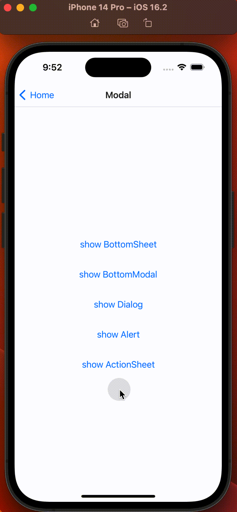
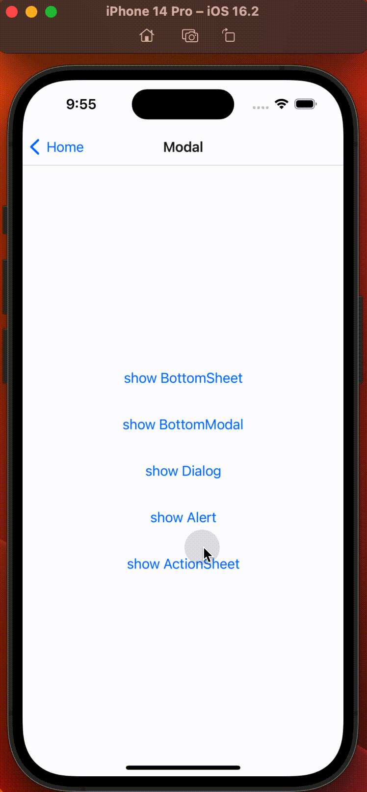

# AlertDialog

## 效果预览




## 特性
1. 当传入 `cancle` 按钮时，组件内会自动将该按钮放置到最底部，并且按钮上方增加分隔色块，点击组件外部 `Backdrop` 也可以关闭 `ActionSheet`；
2. 反之，按钮之间不会用色块分隔，点击组件外部 `Backdrop` 也不会响应关闭事件。

## 使用方法

```typescriptreact
<ActionSheet
  visible={actionSheetVisible}
  content={'弹窗内容弹窗内容弹窗内容弹窗内容弹窗内容弹窗内容弹窗内容'}
  actions={[
    {
      text: '取消',
      type: 'cancel',
      onPress: () => setActionSheetVisible(false),
    },
    {
      text: '确定',
      type: 'primary',
      onPress: () => setActionSheetVisible(false),
    },
    {
      text: '危险',
      type: 'danger',
      onPress: () => setActionSheetVisible(false),
    },
  ]}
/>
```
