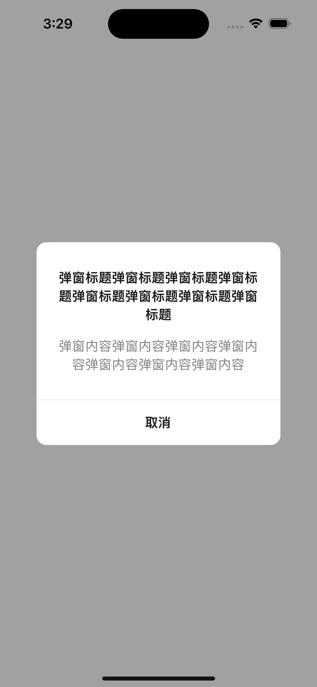
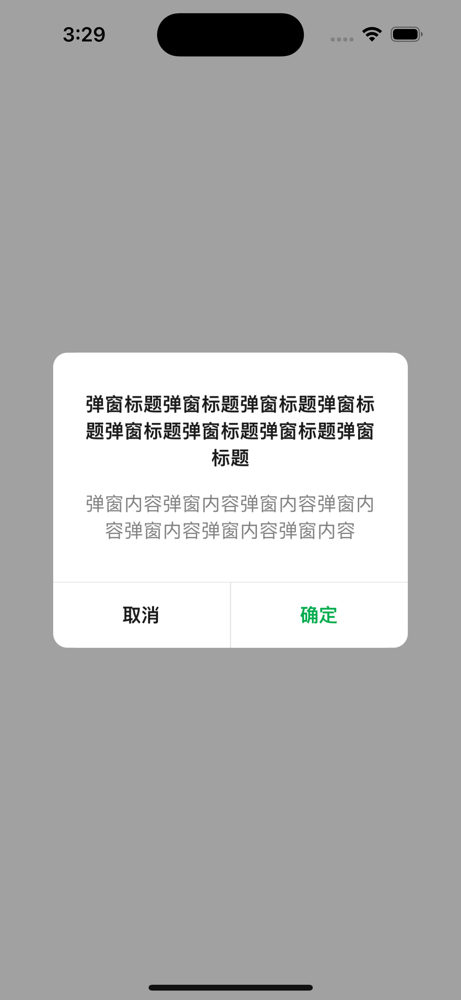
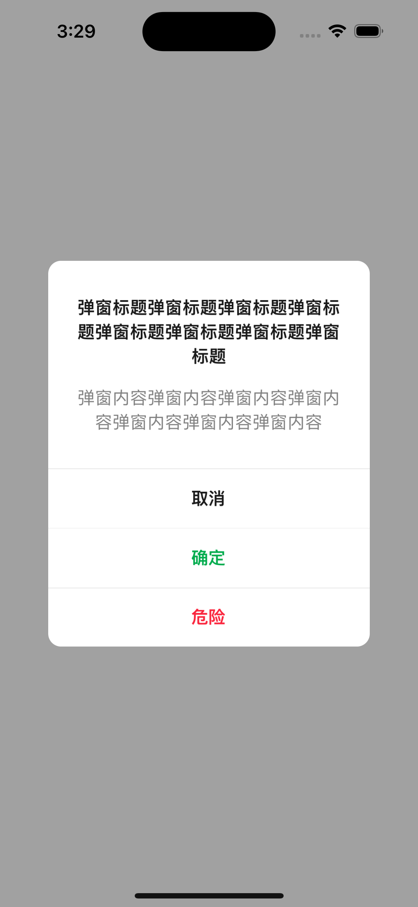

# AlertDialog

## Screen shots





## Usage

```typescriptreact
<AlertDialog
  visible={alertVisible}
  title={
    '弹窗标题弹窗标题弹窗标题弹窗标题弹窗标题弹窗标题弹窗标题弹窗标题'
  }
  content={'弹窗内容弹窗内容弹窗内容弹窗内容弹窗内容弹窗内容弹窗内容'}
  actions={[
    { text: '取消', onPress: () => setAlertVisible(false) },
    // {
    //   text: '确定',
    //   type: 'primary',
    //   onPress: () => setAlertVisible(false),
    // },
    // {
    //   text: '危险',
    //   type: 'danger',
    //   onPress: () => setAlertVisible(false),
    // },
  ]}
/>

```
