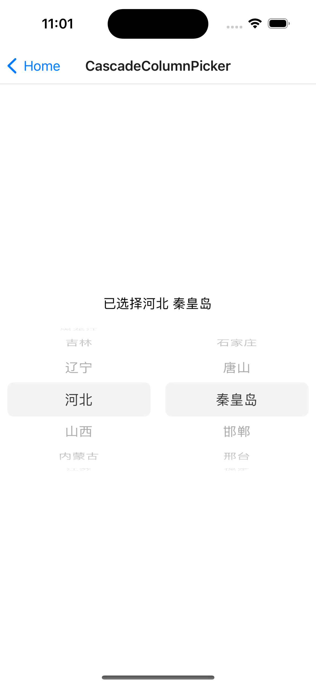

# CascadeColumnPicker - 级联选择器

## Screen shots



## Usage

```typescript
// 数据需为数组，数组内的元素需满足以下条件：
const data = [
  {
    label: '黑龙江',
    value: 'heilongjiang',
    children: [
      { label: '哈尔滨', value: 'haerbin' },
      { label: '齐齐哈尔', value: 'qiqihaer' },
      { label: '牡丹江', value: 'mudanjiang' },
      { label: '佳木斯', value: 'jiamusi' },
      { label: '大庆', value: 'daqing' },
      { label: '鸡西', value: 'jixi' },
    ],
  },
  {
    label: '吉林',
    value: 'jilin',
    children: [
      { label: '长春', value: 'changchun' },
      { label: '吉林', value: 'jilin' },
      { label: '四平', value: 'siping' },
      { label: '辽源', value: 'liaoyuan' },
      { label: '通化', value: 'tonghua' },
      { label: '白山', value: 'baishan' },
    ],
  },
  // ...
];

// 记录选择项
const [selection, setSelection] = React.useState<PickerItemData[]>();

// 计算选择项的 value，需为数组格式
const selectionValue = useMemo(() => {
  if (selection) {
    return selection.map((item) => item.value);
  }
  return [];
}, [selection]);

// 渲染组件
return (
  <View style={styles.container}>
    <CascadeColumnPicker
      dataSource={data}
      columns={2}
      selection={selectionValue}
      onValueChange={(value) => {
        setSelection(value);
      }}
    />
  </View>
);
```
